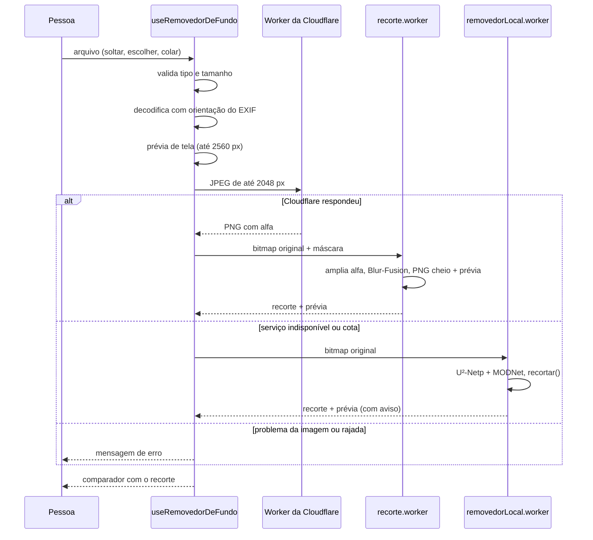
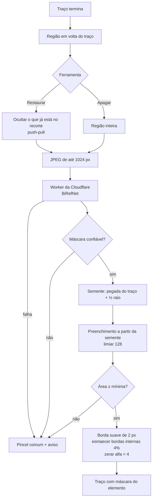

# Removedor de fundo

Documentação da ferramenta `/removedor-de-fundo`: o que ela faz, como cada
parte funciona, por que foi feita assim, quais são os limites e o que fazer
para evoluir.

A operação do Worker da Cloudflare — deploy, limites, pausa de emergência,
diagnóstico — está no manual próprio,
[`workers/removedor-de-fundo/README.md`](../workers/removedor-de-fundo/README.md).
Este documento cita o Worker só no que é preciso para entender a feature.

---

## Sumário

1. [Visão geral](#1-visão-geral)
2. [Mapa dos arquivos](#2-mapa-dos-arquivos)
3. [O caminho de uma foto](#3-o-caminho-de-uma-foto)
4. [Qualidade da saída](#4-qualidade-da-saída)
5. [Memória e desempenho](#5-memória-e-desempenho)
6. [Modo leve](#6-modo-leve)
7. [Ajuste do recorte com pincel](#7-ajuste-do-recorte-com-pincel)
8. [Pincel mágico](#8-pincel-mágico)
9. [Fundo e exportação](#9-fundo-e-exportação)
10. [Integração com o site](#10-integração-com-o-site)
11. [Escolha do modelo](#11-escolha-do-modelo)
12. [O que foi tentado e descartado](#12-o-que-foi-tentado-e-descartado)
13. [Testes](#13-testes)
14. [Limitações conhecidas e pendências](#14-limitações-conhecidas-e-pendências)

---

## 1. Visão geral

A pessoa solta, escolhe ou cola uma imagem. Em poucos segundos aparece o
recorte, com uma divisória para comparar antes e depois. Ela pode trocar o
fundo (transparente, branco, preto ou qualquer cor), corrigir o recorte com
pincel e baixar ou copiar o PNG.

Princípios que guiaram cada decisão:

| Princípio | Como se traduz |
|---|---|
| **Custo zero** | Recorte no plano Free da Cloudflare, com travas que param antes do limite. Sem servidor, sem custo fixo. |
| **Saída com a qualidade da entrada** | O PNG sai na resolução da foto, e os pixels opacos são idênticos aos da original. |
| **Leve** | O modelo pesado roda na Cloudflare. O navegador só aplica a máscara, e a tela trabalha com prévias. |
| **Nunca deixar a pessoa sem recorte** | Se a Cloudflare não responde ou a cota acaba, um modo leve no aparelho assume, com aviso honesto. |
| **Nada fica guardado** | A imagem é processada e descartada; o IP não é gravado. |

**O que a página aceita:** JPG, PNG, WEBP e AVIF, até 80 MB. HEIC não é
aceito (só o Safari decodifica), e a mensagem pede outro formato.

**Formas de enviar:** arrastar e soltar em qualquer ponto da página, clicar no
palco ou no botão "Escolher imagem", ou colar (⌘V / Ctrl+V) de qualquer lugar
fora de um campo de texto. Soltar outra imagem com uma já na tela troca a
imagem.

---

## 2. Mapa dos arquivos

### Página e componentes

| Arquivo | Responsabilidade |
|---|---|
| `src/app/removedor-de-fundo/page.tsx` | Metadados de SEO e JSON-LD (`toolSchema`, `breadcrumbSchema`). Servidor. |
| `src/app/removedor-de-fundo/RemovedorDeFundoClient.tsx` | A página: layout, soltar/colar, palco, controles, atalhos, exportação, rodapé de privacidade. |
| `src/components/removedor/Comparador.tsx` | Foto e recorte sobrepostos com divisória arrastável; no modo de edição, vira tela de pintura. |
| `src/components/removedor/CamadaDoRecorte.tsx` | Canvas que desenha o recorte com os traços, o traço em andamento, a marca do pincel mágico e o cursor do pincel. |
| `src/components/removedor/AjustesDoRecorte.tsx` | Botões Apagar/Restaurar, desfazer/refazer, slider de tamanho, chave do pincel mágico, dicas. |
| `src/components/removedor/SeletorDeFundo.tsx` | Grupo de rádio com transparente, branco, preto e cor livre. |

### Lógica

| Arquivo | Responsabilidade |
|---|---|
| `src/lib/useRemovedorDeFundo.ts` | Hook que orquestra tudo: decodificação, envio à Cloudflare, workers, modo leve, estado, exportação com traços, pincel mágico. |
| `src/lib/removedorDeFundo.ts` | Regras puras: URL do Worker, tamanhos, limites de pixels, validação, interpretação de falhas, modelos do modo leve, ampliação do alfa, nomes de arquivo, protocolos dos workers. |
| `src/lib/recorte.ts` | `recortar()`: aplica uma máscara à imagem em resolução cheia e gera a prévia. |
| `src/lib/primeiroPlano.ts` | Blur-Fusion: corrige a cor das bordas semitransparentes. |
| `src/lib/recorte.worker.ts` | Worker de trabalho pesado sem modelo: aplicar máscara, aplicar traços, preparar região e selecionar elemento do pincel mágico. |
| `src/lib/removedorLocal.worker.ts` | Worker do modo leve: U²-Netp + MODNet em WebAssembly. |
| `src/lib/pincel.ts` | Modelo do traço (vetorial), tamanhos, carimbos, atalhos. Puro. |
| `src/lib/pincelCanvas.ts` | Desenho dos traços num canvas, igual na tela e na exportação. |
| `src/lib/pincelMagico.ts` | Região do traço, seleção do elemento, confiabilidade da máscara, ocultação do que já está no recorte. Puro. |
| `src/lib/useTamanhosDoPincel.ts` | Tamanho de cada ferramenta e chave do pincel mágico, lembrados no `localStorage`. |

### Infraestrutura

| Arquivo | Responsabilidade |
|---|---|
| `workers/removedor-de-fundo/` | Worker da Cloudflare: recorte com BiRefNet e travas de custo. |
| `public/modelos/u2netp-v1.onnx` | Modelo do modo leve para objetos (4,4 MB). |
| `public/modelos/modnet-q-v1.onnx` | Modelo do modo leve para pessoas (7,1 MB, quantizado). |
| `next.config.ts` | Headers de isolamento de origem na rota, COEP nos estáticos e cache imutável dos modelos. |
| `src/app/globals.css` | `.xadrez` (fundo transparente), `.varredura` (animação de processamento) e tema claro do dialkit. |
| `src/lib/rotas.ts`, `src/components/shell/*` | Entrada no menu e na busca com a etiqueta "Novo". |
| `src/app/sitemap.ts` | Rota no sitemap com prioridade 0,9. |

---

## 3. O caminho de uma foto



Passo a passo, com os números reais:

1. **Validação** (`validarArquivo`): tipo em `image/jpeg`, `image/png`,
   `image/webp` ou `image/avif`; não vazio; até 80 MB.
2. **Decodificação** (`decodificar`): `createImageBitmap` com
   `imageOrientation: "from-image"`. Foto de celular vem deitada no arquivo e
   de pé no EXIF; a orientação precisa ser aplicada para o recorte se sobrepor
   exatamente ao `` do original.
3. **Tamanho de trabalho** (`dimensoesDeTrabalho`): a resolução original, a
   menos que passe do limite do navegador (16.777.216 px no iPhone e iPad,
   64.000.000 px nos demais). Só nesse caso a imagem é reduzida, mantendo a
   proporção e arredondando para baixo, e a página avisa.
4. **Prévia de tela** (`imagemDeTela`): o próprio arquivo se o lado maior
   couber em 2560 px; senão, uma cópia de 2560 px (JPEG 0,92 se a entrada for
   JPEG, PNG se puder ter transparência).
5. **Cópia de envio** (`copiaParaEnvio`): JPEG 0,92 com lado maior de até
   2048 px, sobre fundo branco (PNG com transparência viraria preto em JPEG).
   Reencodar resolve três coisas: o EXIF já vai aplicado, o upload fica
   pequeno e AVIF chega num formato que o Worker aceita.
6. **Envio** (`enviarAoRemovedor`): `POST` sem cookie e sem referer, com 30 s
   de tempo limite. Trocar de imagem ou limpar cancela o envio.
7. **Resposta interpretada** (`interpretarFalha`): sucesso segue para o passo
   8; problemas do serviço vão para o modo leve; problemas da imagem ou de
   rajada viram mensagem de erro com "Tentar de novo" e "Escolher outra".
8. **Aplicação da máscara** (`recorte.worker.ts` → `recortar`): o alfa da
   máscara é ampliado para a resolução de trabalho, a cor das bordas é
   corrigida, e saem dois PNGs — o recorte em resolução cheia e uma prévia de
   até 2560 px.
9. **Pronto**: a tela mostra a prévia; o PNG cheio fica guardado para a
   exportação. O rodapé diz quanto levou e onde foi feito.

### Regras de falha

| Situação | Resultado |
|---|---|
| Sem rede, tempo limite, CORS bloqueado, 5xx, resposta ilegível | Modo leve, aviso: "O removedor completo não respondeu…" |
| `pausado`, `indisponivel` | Modo leve, mesmo aviso |
| `cota` (mês) | Modo leve, aviso de limite do mês |
| `cota-diaria` | Modo leve, aviso de que volta amanhã |
| `limite-ip-dia` | Modo leve, aviso de que os recortes completos da pessoa voltam amanhã |
| `limite` ou 429 | Erro: "Muitas imagens em sequência. Espere um minuto e tente de novo." |
| `formato`, `imagem` | Erro: "Não foi possível ler essa imagem. Tente outra em JPG, PNG ou WEBP." |
| `tamanho` | Erro: "Essa imagem passou do tamanho que o removedor aceita." |

A lógica é: se o problema é do serviço, a pessoa não tem culpa nem o que
fazer, então recebe um recorte. Se o problema é da imagem ou do ritmo, o modo
leve não resolveria nada diferente, e o certo é dizer o que aconteceu.

---

## 4. Qualidade da saída

### A garantia

- **Resolução:** o PNG sai com a largura e a altura da imagem de trabalho, que
  é a original sempre que o navegador aguenta (ver limites abaixo).
- **Pixels opacos idênticos:** todo pixel com alfa final 255 tem exatamente o
  RGB da foto original. Só as bordas semitransparentes têm a cor recalculada.
- **Validado:** num teste automatizado em navegador real, com PNGs de
  2000 × 1333 e 3200 × 2400, a saída teve as mesmas dimensões da entrada e
  100% dos pixels opacos idênticos à original (diferença máxima 0).

A resolução enviada à Cloudflare (2048 px) **não limita** a saída: o modelo
decide a forma numa resolução menor de qualquer jeito, e a máscara é ampliada
com interpolação bilinear para a foto inteira. O detalhe fino da borda —
fios de cabelo — vem da combinação do alfa ampliado com a correção de cor na
resolução cheia.

### O que acontece com cada pixel

Em `aplicarMascaraComCorDaFrente` (`src/lib/primeiroPlano.ts`):

| Alfa da máscara | Resultado |
|---|---|
| ≥ 250 | Opaco (255), cor original intacta |
| ≤ 3 | Totalmente transparente (0) |
| 4 a 249 | Alfa mantido; cor do primeiro plano reestimada |

Os limites de 250 e 3 existem porque um alfa de 254 no corpo inteiro não
aparece na tela, mas faz o PNG sair translúcido em editores; e alfa de 1 a 3
vira pixel solto invisível.

### Correção de cor das bordas (Blur-Fusion)

Um fio de cabelo ocupa só parte do pixel, e a câmera registra a mistura
`I = α·F + (1 − α)·B` da cor do fio (F) com a do fundo (B). A máscara acerta o
α, mas a cor do pixel ainda é a mistura. Sobre um fundo novo, o fundo antigo
aparece como halo. Num recorte real medido, 41% dos pixels semitransparentes
do topo da cabeça tinham a cor do fundo.

A correção é o **Blur-Fusion** (Forte e Pitié, *Approximate Fast Foreground
Colour Estimation*, ICIP 2021): estima F e B locais por médias ponderadas pelo
α e resolve a equação para F.

- Duas passadas: uma larga (raio = lado da grade ÷ 12) para achar a cor de
  fundo e uma estreita (raio = lado ÷ 170) para o detalhe.
- As médias são calculadas numa **grade de até 1024 px**, porque variam
  devagar por construção. Só a fórmula final roda na resolução cheia, e só nos
  pixels semitransparentes, amostrando as médias com interpolação bilinear.
- Numa foto de 12 MP, isso é a diferença entre ~60 MB e ~900 MB de memória.

### Limites técnicos de resolução

| Ambiente | Limite | Por quê |
|---|---|---|
| iPhone e iPad (WebKit) | 16.777.216 px (4096²) | Acima disso o canvas não dá erro: devolve imagem em branco. |
| Demais navegadores | 64.000.000 px | Cobre câmeras de 48 e 50 MP. Cada megapixel custa 4 MB por cópia, e o recorte precisa de algumas cópias vivas. |
| Arquivo | 80 MB | Uma foto de 48 MP passa de 20 MB em JPEG e de 60 MB em PNG. |

Quando a imagem passa do limite, a página mostra: "A original tem L × A. Este
navegador não processa imagens desse tamanho, então reduzimos ao máximo que
ele aceita. Num computador, ela sai na resolução original."

O iPadOS se apresenta como Mac; a detecção (`ehIos`) usa
`navigator.maxTouchPoints > 1` para reconhecê-lo.

### O que não é preservado

| Item | O que acontece | Motivo |
|---|---|---|
| Profundidade de 16 bits | Sai em 8 bits por canal | O canvas 2D do navegador trabalha em 8 bits |
| Perfil de cor amplo (Display P3) | Convertido para sRGB | O canvas decodifica em sRGB; não há suporte a canvas P3 implementado |
| Metadados EXIF, IPTC, XMP | Não são copiados para o PNG | O PNG é gerado do canvas; a orientação do EXIF já vem aplicada nos pixels |
| Formato | Sempre PNG | Único formato comum com transparência que todo programa abre |

---

## 5. Memória e desempenho

A máquina de referência para as decisões foi um computador com 8 GB de RAM.
Uma versão anterior, que rodava o BiRefNet no navegador, esgotou a memória e
desligou a máquina (ver [seção 12](#12-o-que-foi-tentado-e-descartado)).

| Decisão | Economia |
|---|---|
| Modelo pesado na Cloudflare, não no navegador | Centenas de MB a alguns GB por recorte |
| Tela com prévias de até 2560 px; só a exportação toca a resolução cheia | ~85 MB por imagem decodificada numa foto de 21 MP |
| Alfa ampliado direto num buffer de 1 byte por pixel | 21 MB em vez de 85 MB de canvas RGBA numa foto de 21 MP |
| Blur-Fusion com médias numa grade de 1024 px | ~60 MB em vez de ~900 MB numa foto de 12 MP |
| Workers criados no primeiro uso, e não ao abrir a página | Quem só visita não paga nada |
| Worker do modo leve só nasce se a Cloudflare falhar | O runtime de inferência não é baixado no caminho normal |
| Workers encerrados após 60 s ociosos | O heap do WebAssembly só cresce; encerrar devolve a memória |
| `canvas.width = canvas.height = 0` depois de usar | Libera a memória do canvas na hora, sem esperar o coletor |
| Bitmaps transferidos (`postMessage(…, [bitmap])`), não copiados | Uma cópia a menos por imagem |
| Traços guardados como vetores e máscaras mágicas como PNG comprimido | 100 passos de histórico não viram centenas de MB |
| Canvas da tela limitado a densidade 2x | Tela 3x não quadruplica a memória |

**Tempos típicos:** o recorte na Cloudflare leva de 1 a 5 s, mais o upload.
Aplicar a máscara numa foto grande leva uma fração de segundo a poucos
segundos, fora da thread principal.

**Trocar de imagem no meio:** cada recorte tem um id crescente. Respostas de
um id antigo são descartadas, o envio antigo é abortado, e as object URLs
antigas são revogadas.

---

## 6. Modo leve

Recorte feito no próprio aparelho, sem rede e sem cota. Só entra quando a
Cloudflare não pode ser usada (ver a tabela de regras de falha na seção 3).

### Modelos

| Modelo | Arquivo | Entrada | Bom em | Ruim em |
|---|---|---|---|---|
| **U²-Netp** | `u2netp-v1.onnx` (4,4 MB) | 320 × 320 | Qualquer objeto em destaque | Cabelo sai em blocos; roupa escura some |
| **MODNet** (quantizado) | `modnet-q-v1.onnx` (7,1 MB) | lado menor 512, múltiplos de 32 | Pessoas, cabelo fio a fio | Qualquer coisa que não seja gente |

Os dois têm licença Apache 2.0. O U²-Netp é a exportação ONNX usada pelo
rembg; o MODNet é o `model_quantized.onnx` do repositório `Xenova/modnet` no
Hugging Face. Juntos somam 11 MB e rodam em pouco mais de um segundo.

**Integridade:** os arquivos ficam em `public/modelos` com a versão no nome,
em vez de virem de repositórios de terceiros em tempo de execução. Antes de
criar a sessão, o worker confere o SHA-256 contra `MODELOS` em
`src/lib/removedorDeFundo.ts`:

| Arquivo | SHA-256 |
|---|---|
| `u2netp-v1.onnx` | `309c8469258dda742793dce0ebea8e6dd393174f89934733ecc8b14c76f4ddd8` |
| `modnet-q-v1.onnx` | `92e49898c3e05a6d7a944fc67a8cb87c4aad754ffb6ebd949528c7d1105fee3a` |

Para trocar um modelo: publique **um arquivo novo** com outra versão no nome
(`-v2`), atualize URL e hash em `MODELOS`. Nunca sobrescreva o arquivo
existente: ele é servido com cache imutável de um ano.

### Como a máscara é escolhida

Em `removedorLocal.worker.ts` → `mascara()`:

1. Roda o U²-Netp e estica a saída para 0–1 (min–max, como no rembg), exceto
   quando a amplitude é menor que 0,2 — aí é ruído, e esticar inventaria um
   recorte.
2. Roda o MODNet. Os dois rodam **em sequência**, não em paralelo, para não
   somar os picos de memória.
3. Compara as duas máscaras por interseção sobre união (IoU, limiar 0,5).
4. **IoU ≥ 0,6 → é pessoa.** Fica a máscara do MODNet, restrita à vizinhança
   do sujeito que o U²-Netp achou (`restringirAoSujeito`: presença > 0,3,
   alargada por média em caixa de raio = lado ÷ 32). Isso elimina manchas
   soltas do MODNet sem cortar cabelo solto.
5. **IoU < 0,6 → não é pessoa.** Fica a máscara do U²-Netp.

O limiar de 0,6 foi medido: retratos, meio corpo e pessoa com mochila deram
0,95 a 0,99; um relógio deu 0,08.

Depois disso, a máscara passa pela mesma `recortar()` do caminho da
Cloudflare, com a mesma garantia de resolução e de pixels opacos.

### Execução

- **onnxruntime-web 1.30.0**, backend WebAssembly (`onnxruntime-web/wasm`), sem
  WebGPU: cada navegador expõe limites diferentes de GPU, e foi num deles que
  o modelo grande anterior quebrou.
- **Threads:** até 4, quando a página está isolada por origem cruzada
  (`crossOriginIsolated`). Sem isolamento, 1 thread.
- **Uma inferência por vez**, numa fila; pedidos de imagens trocadas enquanto
  esperavam são descartados.
- As sessões são criadas uma vez e reaproveitadas. Se a criação falhar, a
  próxima imagem tenta de novo.

### Isolamento de origem cruzada

Threads no WebAssembly exigem `SharedArrayBuffer`, que exige a página isolada.
`next.config.ts` aplica:

| Rota | Headers |
|---|---|
| `/removedor-de-fundo` | `Cross-Origin-Opener-Policy: same-origin`, `Cross-Origin-Embedder-Policy: credentialless` |
| `/_next/static/:path*` | `Cross-Origin-Embedder-Policy: credentialless` |
| `/modelos/:path*` | `Cache-Control: public, max-age=31536000, immutable` |

- `credentialless`, e não `require-corp`, para não exigir
  `Cross-Origin-Resource-Policy` de recursos externos, como analytics.
- Só na rota, porque COOP isola a janela e quebraria popups e integrações que
  dependem de `window.opener` no resto do site.
- O COEP nos estáticos é obrigatório: numa página com COEP, o script de um
  worker precisa trazer COEP compatível, senão o Chrome bloqueia o worker
  (`ERR_BLOCKED_BY_RESPONSE`) e **nenhum** worker do removedor carrega. Em JS,
  CSS e fontes o header é inerte.
- Quem chega à rota por navegação do lado do cliente (clicando no menu) não
  recebe os headers daquele documento. Tudo funciona igual; o modo leve só
  roda com uma thread.

---

## 7. Ajuste do recorte com pincel

Com o recorte pronto, aparece "Ajustar recorte" com duas ferramentas.

| Ferramenta | Tecla | Pincel comum | Com pincel mágico |
|---|---|---|---|
| **Apagar** | `E` | Tira do recorte a área pintada | Tira o elemento inteiro que o traço tocou |
| **Restaurar** | `R` | Traz de volta a área pintada, com a cor da foto original | Traz de volta o elemento inteiro que o traço tocou |

### Comportamento da tela

- As ferramentas são botões de alternância: clicar na ativa desliga, e
  "nenhuma" é o estado de comparar antes e depois.
- Com uma ferramenta ativa, a divisória do comparador recolhe e a imagem vira
  tela de pintura. Uma pílula no topo diz "Apagando" ou "Restaurando" (com
  "com o pincel mágico" quando ligado), mostra "Esc para sair" e tem o botão
  **Concluir** — a saída no toque, onde não há Escape.
- No Restaurar, a foto original aparece por baixo com 35% de opacidade, para
  a pessoa ver o que pode trazer de volta.
- O cursor é um anel do tamanho real do pincel.

### Atalhos

| Atalho | Ação |
|---|---|
| `E` / `R` | Liga ou desliga Apagar / Restaurar |
| `[` / `]` | Diminui / aumenta o pincel em 15% do tamanho atual (passo mínimo de 2 px) |
| ⌘Z / Ctrl+Z | Desfazer |
| ⇧⌘Z / Ctrl+Shift+Z / Ctrl+Y | Refazer |
| `Esc` | Sai da ferramenta |

Nenhum atalho age com o foco num campo de texto, exceto `Esc`. ⌘E e ⌘R não
são capturados: continuam com o navegador. `[`/`]` só
agem com uma ferramenta ativa; `Esc` sem ferramenta segue para quem mais
estiver ouvindo.

### Tamanho do pincel

- Diâmetro em **pixels de tela**, de 4 a 160 px, pelo slider ou por `[`/`]`.
  Em tela, e não na imagem, porque é assim que se sente: 40 px é o mesmo gesto
  numa foto de 800 ou de 4000 px.
- Cada ferramenta lembra o seu: Apagar começa em 48 px (gesto largo), Restaurar
  em 24 px (gesto fino).
- O traço converte o tamanho para pixels da imagem quando começa; redimensionar
  a janela depois não muda o que já foi pintado.
- Tamanhos e a chave do pincel mágico ficam no `localStorage`
  (`geradoor:removedor:tamanhos-do-pincel` e `geradoor:removedor:pincel-magico`).
  Em janela anônima ou com armazenamento bloqueado, os valores iniciais valem
  só na sessão.

### Como os traços funcionam

- **Vetores, não pixels.** Um traço é `{ ferramenta, raio, pontos, magia? }`
  em coordenadas da imagem. Desfazer é barato, e o mesmo traço é desenhado na
  tela (resolução de janela) e na exportação (resolução cheia).
- **Carimbos.** O traço é desenhado como círculos a cada ¼ de raio,
  interpolados entre pontos distantes (mouse rápido pula pixels). Círculos, e
  não `stroke()`, porque o Restaurar precisa da área como região de recorte
  (`clip`), e uma linha não é área.
- **Pontos redundantes são ignorados**: só entra um ponto que andou pelo menos
  ⅛ de raio desde o último.
- **Apagar** usa `destination-out`. **Restaurar** recorta a área e desenha a
  foto original dentro dela, opaca — devolve o pixel com a cor que a câmera
  registrou.
- **Desenho incremental** durante a pincelada (só os carimbos novos) e
  redesenho completo quando os traços mudam (desfazer, refazer), a tela muda de
  tamanho ou as imagens mudam.
- **Histórico** de até 100 passos (`useHistorico`).
- **Recorte novo zera os ajustes** e desliga a ferramenta: traços de uma imagem
  não fazem sentido sobre outra.
- **O que se vê é o que se baixa:** tela e exportação chamam a mesma
  `desenharRecorteEditado`, mudando só a escala.

### Exportação dos traços

Na tela, os traços são pintados sobre a prévia. Ao baixar ou copiar,
`aplicarTracos` manda ao `recorte.worker` o PNG cheio, o arquivo original e os
traços; o worker decodifica o original no tamanho de trabalho e repinta tudo
em resolução cheia. O resultado fica em cache enquanto os traços não mudarem,
então baixar e depois copiar não repinta duas vezes.

---

## 8. Pincel mágico

O pincel comum devolve exatamente a área pintada: numa flor sobre folhas, vem
flor, folha e o que mais estiver no círculo, com borda redonda. O **pincel
mágico** seleciona o elemento que o traço tocou, com a borda do modelo. O
traço só diz *qual* elemento.

Vem **ligado por padrão**. A chave fica abaixo do slider, com o texto
"Recorta o elemento inteiro. Cada pincelada conta como um recorte."

### Custo

**Cada pincelada mágica é uma chamada ao Worker da Cloudflare** e consome um
recorte do mês, do dia e do limite diário do IP da pessoa, exatamente como uma
foto. Quando esses limites acabam, o pincel mágico passa a aplicar o pincel
comum, com aviso.

### Pipeline



1. **Região do traço** (`regiaoDoTraco`): retângulo que envolve o traço, com
   folga de metade do maior lado do traço, **entre 96 e 240 px** de cada lado;
   lado mínimo de 512 px; deslizado para dentro da imagem quando encosta na
   borda (em vez de encolher). Retangular, e não quadrado: um traço
   horizontal numa fileira de flores não precisa trazer céu e chão.
2. **Ocultar o que já ficou** (só no Restaurar, `ocultarOQueJaFicou`): o
   modelo recorta "o assunto principal" da imagem que recebe. Se a região
   contém o sujeito já recortado (a flor na mão), o modelo escolhe ele de novo
   em vez do que se quer incluir (as flores de baixo). Então os pixels já
   incluídos (alfa ≥ 128 no recorte atual com os traços), dilatados em lado ÷ 96,
   são preenchidos com as cores do entorno por **push-pull** (pirâmide de
   médias ponderadas, Gortler et al., *The Lumigraph*, 1996). Sem blocos nem
   contorno que o modelo pudesse confundir com objeto. No Apagar, a região vai
   inteira, porque o alvo é justamente o que já está no recorte.
3. **Envio**: a região em JPEG 0,92, lado maior de até 1024 px (o BiRefNet
   decide nessa ordem de grandeza; mais que isso só deixaria a resposta mais
   lenta). Mesmo Worker, mesmas travas, mesmo tempo limite de 30 s.
4. **Máscara confiável?** (`mascaraConfiavel`): conta os pixels em dúvida
   (alfa entre 40 e 215). Quando o modelo acha um elemento, a máscara é quase
   binária — medido: 0,3% a 4% em dúvida. Quando não acha, devolve um cinza
   granulado — 77% a 99%. **Até 25%** conta como confiável.
5. **Semente**: a área pintada rasterizada na grade da máscara (`pegadaNaGrade`),
   ampliada em **meio raio** do pincel por transformada de distância chanfrada
   3-4 (`distanciaAtePegada`). Cobre a imprecisão da mão e o caso do traço que
   passa por um caule ou miolo escuro que o modelo marcou como fundo.
6. **Preenchimento** (`selecionarElemento`): pixels da semente com alfa ≥ 128
   iniciam um preenchimento por vizinhança de 4 que segue enquanto o alfa for
   ≥ 128. Partes segmentadas que o traço não tocou — a flor do lado — ficam de
   fora.
7. **Área mínima**: o elemento precisa ter pelo menos **64 px** da grade e
   **5% da área pintada**. Menos que isso é ruído.
8. **Acabamento**:
   - pixels colados ao elemento (até 2 px) entram com o alfa do modelo, para a
     borda ficar macia;
   - nas bordas da região que cortam a foto no meio, a seleção esmaece até
     zero numa faixa de 4% do lado, para não terminar num corte reto no meio
     de uma pétala (nas bordas que coincidem com a borda da foto, não);
   - alfa abaixo de 4 vira 0.
9. **Aplicação**: o traço ganha `magia: { regiao, mascara }` (PNG só de alfa).
   No **Apagar**, a máscara é aplicada com `destination-out`. No **Restaurar**,
   a foto original é recortada pela máscara num canvas do tamanho da região e
   desenhada por cima.

### Durante o processamento

- A marca do traço fica visível em vermelho (Apagar) ou verde (Restaurar), a
  45% de opacidade, pulsando.
- A pílula mostra "Recortando o elemento" com um indicador.
- O cursor vira espera e **novos traços não começam** até o atual terminar.

### Quando vira pincel comum

O traço **nunca é descartado**. Se não der, a área pintada é aplicada como
pincel comum, com um aviso, e a pessoa desfaz se não quiser.

| Situação | Aviso |
|---|---|
| Máscara não confiável ou nenhum elemento com área suficiente sob o traço | "Não encontrei um elemento definido aí, então apliquei o pincel comum na área pintada." |
| Serviço indisponível, pausado ou sem cota | "O pincel mágico não está disponível agora, então apliquei o pincel comum na área pintada." |
| Rajada ou problema de imagem | A mensagem do erro + "Por enquanto, apliquei o pincel comum na área pintada." |
| Qualquer erro inesperado nos workers | "O pincel mágico não conseguiu processar este traço, então apliquei o pincel comum na área pintada." |

### Resultados medidos

Numa bateria de 8 traços de restaurar sobre uma foto real (pessoa segurando
uma flor, com flores ao fundo): **6 selecionaram o elemento certo**; 2 — um
canto da imagem e uma flor desfocada ao fundo — caíram no pincel comum, como
esperado.

### Limitações

- **Não seleciona o que o modelo considera fundo.** Flores desfocadas, textura
  de parede, céu: o BiRefNet é treinado para achar o sujeito em destaque, e
  nessas regiões a máscara sai em dúvida. Resultado: pincel comum.
- **No Apagar, pode levar mais que o esperado** se o elemento tocado estiver
  conectado ao sujeito na máscara (uma mão segurando um objeto). Desfazer
  resolve.
- **Latência:** cada pincelada espera o upload da região e o modelo na
  Cloudflare — da ordem de alguns segundos, mais lento em rede móvel.

---

## 9. Fundo e exportação

### Fundo

`SeletorDeFundo` é um `radiogroup` de verdade (setas mudam a escolha, Tab entra
e sai numa parada só):

| Opção | Valor |
|---|---|
| Transparente | nulo (xadrez na tela) |
| Branco | `#ffffff` |
| Preto | `#000000` |
| Cor livre | seletor nativo do sistema, começando em `#e8e1d7` |

Na tela, a cor é aplicada com CSS atrás do PNG transparente, instantânea. O
PNG com fundo só é gerado no clique de exportar (`recorteSobreCor`), porque
codificar uma imagem de 12 MP leva perto de um segundo.

### Baixar e copiar

- **Baixar PNG:** gera o arquivo (recorte → traços em resolução cheia → cor, se
  houver) e baixa como `<nome-original>-sem-fundo.png`. Caracteres inválidos em
  nome de arquivo viram hífen; nome vazio vira `imagem-sem-fundo.png`.
- **Copiar:** mesmo arquivo, para a área de transferência como `image/png`. A
  promessa vai direto no `ClipboardItem`, sem `await` antes, porque o Safari
  só aceita escrever dentro do gesto do clique. Se o navegador recusar:
  "Seu navegador não deixou copiar. Use Baixar PNG."
- Os dois botões ficam desabilitados enquanto não há recorte e durante uma
  exportação.

### Rodapé de privacidade

O texto diz a verdade sobre o caminho da imagem:

- Recorte na Cloudflare: "Recortado em X. A imagem não fica guardada."
- Modo leve: "Recortado no modo leve em X, sem sair do aparelho."

**Limpar** cancela o envio, encerra os workers, revoga as URLs e volta ao
estado inicial.

---

## 10. Integração com o site

- **Menu e busca:** entrada em `src/lib/rotas.ts` com `novo: true`, ícone
  `Eraser`, rótulo curto "Remover fundo" e termos de busca ("remover fundo",
  "tirar fundo", "png transparente", "recortar", "remove bg"…). A etiqueta
  vem de `src/components/shell/EtiquetaNovo.tsx`, usada pela `Sidebar` e pelo
  `SearchCommand`. Para tirar a etiqueta no futuro, remova `novo: true`.
- **Layout:** a rota está em `SEM_MOLDURA` (`AppShell.tsx`): a página desenha a
  própria moldura. No desktop, duas colunas (texto e controles à esquerda,
  palco com 58% à direita); no celular, uma coluna com o palco entre o
  cabeçalho e os controles.
- **SEO:** título "Removedor de fundo de imagem online e grátis", descrição,
  `toolSchema` com as funcionalidades e `breadcrumbSchema`. Sitemap com
  prioridade 0,9.
- **Tema claro do dialkit:** o slider do dialkit nasce com paleta escura e só
  troca com `data-theme="light"`, que o site não usa (o tema é a classe
  `dark` do next-themes). `globals.css` aplica a paleta clara em
  `html:not(.dark) .dialkit-root`. Em CSS, e não pelo React, para não piscar
  escuro antes da hidratação. A regra também corrige o slider de tamanho do
  logo no QR Code.
- **Acessibilidade:** divisória do comparador operável por teclado (passos de
  5%), status de processamento em `aria-live`, seletor de fundo como
  `radiogroup`, animações respeitando `prefers-reduced-motion`, dicas de
  teclado escondidas em telas de toque (`apenas-mouse`).

---

## 11. Escolha do modelo

### O que está em uso

**BiRefNet** (*Bilateral Reference for High-Resolution Dichotomous Image
Segmentation*, licença MIT), via Cloudflare Images com
`segment: "foreground"`. A Cloudflare publicou a avaliação de modelos de
segmentação que fez antes de escolhê-lo. É o modelo aberto de referência, e
vários produtos comerciais são construídos sobre ele.

O Cloudflare Images **não expõe** qual variante roda nem em que resolução. O
BiRefNet tem variantes de 1024 px e de 2048 px (a de 2048 é melhor em fios de
cabelo); não há como escolher.

### Comparação (setembro de 2026)

| Modelo | Onde ganha | Por que não está em uso |
|---|---|---|
| **BiRefNet** (em uso) | Referência aberta, MIT, variantes de alta resolução | — |
| **BEN2** | Cabelo e pelo: uma rede de refinamento reprocessa só os pixels duvidosos, em até 4K | Sem opção gratuita sem servidor: exige GPU própria ou API paga por imagem |
| **Bria RMBG-2.0** | Fundos complexos. A Bria relata 90% contra 85% do BiRefNet, em benchmark próprio | Pesos com licença não comercial; uso comercial exige licença ou API paga |
| **remove.bg, Photoroom** | Fechados, muito bons em cabelo | Cobram por imagem |
| **SAM 3.1** (Meta) | Seleção por texto ou clique de qualquer objeto | Resolve "qual objeto", não a borda fina; seria complemento, não substituto |
| **Qualquer modelo grande no navegador** | Custo zero | Esgota a memória em máquinas de 8 GB e derruba a aba no Safari (seção 12) |

**Conclusão:** dentro da restrição de custo zero sem custo fixo, o BiRefNet da
Cloudflare é a melhor opção disponível. Os modelos melhores em cabelo existem,
mas custam por imagem ou exigem servidor.

### Como evoluir

Se a qualidade em cabelo passar a justificar custo:

1. **Comparar antes de decidir.** Rodar o mesmo conjunto de fotos reais (retrato
   com cabelo solto, pessoa segurando objeto, produto sobre fundo complexo,
   animal com pelo) no BiRefNet atual, no BEN2 e no RMBG-2.0, e comparar lado a
   lado sobre fundo branco, preto e colorido. Benchmark de fabricante não
   substitui isso.
2. **Oferecer como modo opcional**, e não trocar o padrão: por exemplo, um
   "alta qualidade" que chama uma API paga, com as mesmas travas de custo do
   Worker atual (limite mensal abaixo do orçamento, por dia, por IP, falha
   fechada).
3. **Onde mexer no código:** o contrato da página com o Worker é "manda
   JPEG, recebe PNG com alfa". Trocar de modelo é trocar o que o Worker chama
   (`IMAGES.input().transform(...)` em `workers/removedor-de-fundo/src/index.ts`).
   A página, a correção de cor, o pincel e a exportação não mudam. Se a nova
   API devolver máscara em resolução maior, vale subir `LADO_MAXIMO_DE_ENVIO`.
4. **Chaves de API** de um serviço pago iriam como `wrangler secret`, nunca em
   `wrangler.jsonc` nem na página.

---

## 12. O que foi tentado e descartado

Registro das abordagens que não funcionaram, para ninguém repetir.

| Tentativa | O que aconteceu | Decisão |
|---|---|---|
| BiRefNet no navegador com WebGPU | Estourou o limite de storage buffers da GPU da Apple | Descartado |
| BiRefNet no navegador com WebAssembly | `bad_alloc` no heap do WASM; no Safari, a aba recarregava por memória | Descartado |
| Modelo grande em teste local | Esgotou os 8 GB de RAM e desligou a máquina | Modelo pesado vai para fora do navegador |
| Só modelos leves no navegador | Recortava partes da foto que não deviam sair; cabelo ruim | Viraram o modo leve de reserva |
| Reduzir toda foto acima de 12 MP | Foto de 21 MP saía com 12 | Resolução original; memória economizada com prévias |
| Filtro guiado para refinar a borda | Criava halos | Substituído pelo Blur-Fusion |
| Curva de contraste na saída do U²-Netp (zerar < 15%) | Jaqueta escura contra fundo escuro sumia | Removida; borda um pouco mais macia é o erro que se perdoa |
| Pincel mágico com densidade de vizinhança | Caía rápido demais longe do traço; não achava a flor | Distância chanfrada até a pegada |
| Pincel mágico incluindo a vizinhança inteira | Devolvia um borrão em vez do elemento | Só o componente conectado à semente |
| Pincel mágico sem ocultar o recorte atual | O modelo escolhia sempre a flor na mão, nunca as de baixo | Ocultar o que já está no recorte antes de enviar |
| Ocultar com média de raio fixo | Retângulos chapados que o modelo recortava como objeto | Push-pull |
| Região quadrada com folga grande | Região de 68% da foto, com outros objetos disputando | Região retangular com folga limitada a 240 px |
| Limiar adaptativo (até metade da maior certeza) | Sem elemento, passavam 132 fragmentos de ruído de 6 px | Limiar fixo 128, máscara confiável, área mínima, recuo para pincel comum |

---

## 13. Testes

```bash
npm test                        # suíte inteira
npx vitest run src/lib          # só a lógica da página
npx vitest run workers          # só o Worker
```

### Automatizados

| Arquivo | Cobre |
|---|---|
| `src/lib/removedorDeFundo.test.ts` | Tamanhos de envio, trabalho e prévia; limites de pixels; validação de arquivo; `interpretarFalha` para cada motivo; normalização e tensor; esticar saída; redimensionar plano; concordância e limiar de pessoa; média em caixa; restrição ao sujeito; ampliação do alfa; nome do arquivo; formatação. |
| `src/lib/primeiroPlano.test.ts` | Pixels opacos e vazios intactos; alfa quase opaco e quase vazio arredondados; cor de fundo removida das bordas; validação de buffers. |
| `src/lib/pincel.test.ts` | Limites e passos de tamanho; carimbos sem buracos; pontos redundantes; ponto na imagem; atalhos com e sem foco em campo. |
| `src/lib/pincelMagico.test.ts` | Região do traço (folga, lado mínimo, deslizamento na borda); pegada; distância chanfrada; máscara confiável; seleção do elemento tocado sem o vizinho; semente perto do traço; área mínima; esmaecimento das bordas internas; push-pull sem blocos; ocultar o que já ficou; avisos de recuo. |
| `workers/removedor-de-fundo/src/*.test.ts` | Ver o manual do Worker, seção 8. |

O que depende de canvas, workers e rede (decodificação, `recortar`, desenho
dos traços, `recorte.worker`, modo leve) não tem teste automatizado na suíte:
foi validado em navegador real. Por isso as regras foram extraídas para
funções puras sempre que possível.

### Roteiro de verificação manual

Antes de publicar uma mudança relevante na feature:

1. **Recorte básico:** retrato com cabelo solto, em JPEG. Conferir borda do
   cabelo sobre fundo branco, preto e colorido.
2. **Resolução:** foto acima de 12 MP. O tamanho mostrado nos controles e o do
   PNG baixado devem ser iguais aos da original.
3. **Orientação:** foto de celular tirada na vertical. O recorte deve se
   sobrepor exatamente ao original ao arrastar a divisória.
4. **Transparência na entrada:** PNG com fundo transparente.
5. **Formatos:** WEBP e AVIF entram; HEIC é recusado com mensagem.
6. **Colar:** print copiado para a área de transferência, ⌘V na página.
7. **Pincel comum:** apagar uma sobra de fundo, restaurar uma parte comida,
   desfazer, refazer, `[`/`]`, `Esc`. Baixar e conferir que os ajustes estão no
   PNG em resolução cheia.
8. **Pincel mágico:** restaurar um elemento da foto que não entrou no recorte;
   apagar um elemento que entrou; um traço sobre fundo liso (deve cair no
   pincel comum com aviso).
9. **Copiar** no Chrome e no Safari.
10. **Modo leve:** no DevTools do Chrome, bloquear o domínio
    `geradoor-removedor-de-fundo.mathuscardoso.workers.dev` (Network → Block
    request domain) e enviar uma foto. O recorte deve sair com o aviso de modo
    leve. Não use o modo offline: ele também bloqueia o download dos modelos
    em `/modelos`, e aí nem o modo leve carrega.
11. **Tema claro e escuro:** slider visível nos dois.
12. **Celular:** layout em uma coluna, pílula "Concluir" no modo de pintura,
    foto grande no iPhone mostrando o aviso de redução.

Cada teste de recorte completo consome cota do mês, do dia e do seu IP.

---

## 14. Limitações conhecidas e pendências

### Limitações

| Limitação | Impacto | Caminho, se um dia valer |
|---|---|---|
| Qualidade em cabelo limitada ao BiRefNet da Cloudflare, sem escolha de variante | Fios muito finos podem sair mais grossos ou com falhas | Modo opcional com BEN2 ou similar, pago e com travas (seção 11) |
| Display P3 convertido para sRGB | Cores muito saturadas de iPhone podem perder um pouco de vivacidade | Canvas com `colorSpace: "display-p3"` e PNG com perfil |
| 16 bits vira 8 bits | Perda irrelevante para uso comum; relevante para edição profissional | Não há caminho simples no navegador |
| EXIF e metadados não copiados | PNG sem data, câmera ou localização (o que também é bom para privacidade) | Copiar blocos de metadados para o PNG |
| iPhone e iPad limitados a 16,7 MP | Foto de 48 MP sai reduzida no celular da Apple | Limitação do WebKit; no computador sai inteira |
| Pincel mágico não seleciona fundo desfocado | Cai no pincel comum | Modelo de seleção por clique (SAM) como complemento |
| Cada pincelada mágica gasta cota | Uso intenso do pincel consome o limite do dia mais rápido | Limites calibrados pelo uso real |
| Modo leve inferior | Quando a cota acaba, a qualidade cai perceptivelmente | Esperado; é a reserva |
| Recorte sobre cor gerado na thread principal | Pequena trava na exportação de imagens muito grandes com fundo colorido | Mover `recorteSobreCor` para o `recorte.worker` |

### Pendências

- [ ] **Voltar `LIMITE_POR_IP_DIA` de 150 para 40** em
  `workers/removedor-de-fundo/wrangler.jsonc` e rodar
  `npm run deploy:removedor`.
- [ ] Deploys de preview da Vercel usam o modo leve, porque a origem não está
  liberada no Worker (ver o manual do Worker, seção 10).
- [ ] Remover a etiqueta "Novo" (`novo: true` em `src/lib/rotas.ts`) quando a
  ferramenta deixar de ser novidade.
