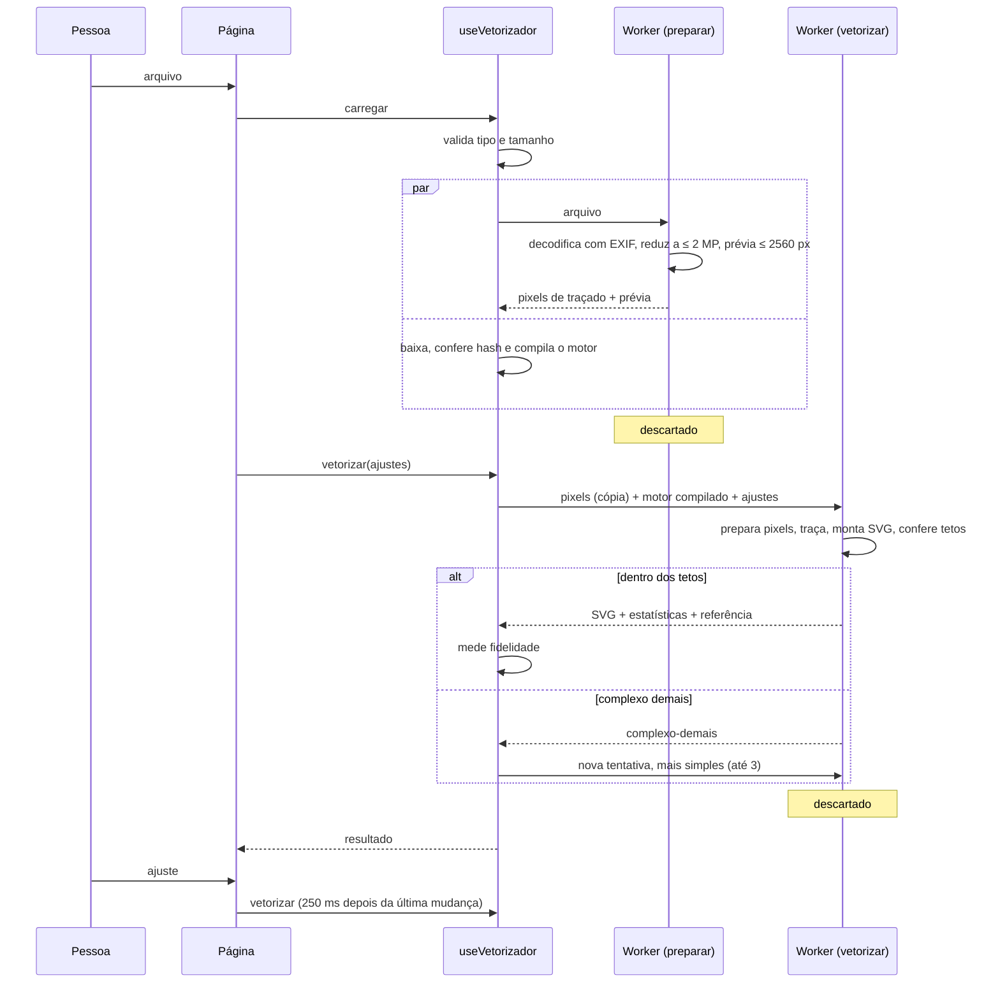

# Vetorizador

Documentação da ferramenta `/vetorizador`: o que ela faz, como cada parte
funciona, por que foi feita assim, quais são os limites e o que fazer para
evoluir.

O motor em WebAssembly — protocolo, compilação, reprodutibilidade, publicação de
versão nova — tem manual próprio:
[`wasm/vetorizador/README.md`](../wasm/vetorizador/README.md).

---

## Sumário

1. [Visão geral](#1-visão-geral)
2. [Mapa dos arquivos](#2-mapa-dos-arquivos)
3. [O caminho de uma imagem](#3-o-caminho-de-uma-imagem)
4. [Preparação dos pixels](#4-preparação-dos-pixels)
5. [Estilos e controles](#5-estilos-e-controles)
6. [Fidelidade](#6-fidelidade)
7. [Garantias contra travar](#7-garantias-contra-travar)
8. [Tela, zoom e exportação](#8-tela-zoom-e-exportação)
9. [Integração com o site](#9-integração-com-o-site)
10. [Por que no navegador](#10-por-que-no-navegador)
11. [O que foi tentado e descartado](#11-o-que-foi-tentado-e-descartado)
12. [Testes](#12-testes)
13. [Limitações conhecidas e pendências](#13-limitações-conhecidas-e-pendências)

---

## 1. Visão geral

A pessoa solta, escolhe ou cola uma imagem. Em menos de um segundo, na maioria
dos casos, aparece o SVG ao lado da original, com divisória para comparar e zoom
para ver as curvas. Ela escolhe um estilo, ajusta cores, detalhe e suavidade —
cada ajuste refaz o SVG em segundos — e baixa o arquivo ou copia o código.

| Princípio | Como se traduz |
|---|---|
| **Custo zero** | Tudo roda no navegador. Sem servidor, sem cota, sem conta para vigiar. |
| **Não travar** | Motor num worker descartável, teto de memória no próprio WebAssembly, tetos de complexidade antes de o SVG chegar à tela (seção 7). |
| **Fiel à imagem** | Cores escolhidas pela imagem, contornos no lugar certo, e a fidelidade medida e mostrada (seção 6). |
| **Privacidade** | A imagem não sai do aparelho. |

**Formatos aceitos:** JPG, PNG, WEBP e AVIF, até 80 MB. HEIC e SVG são recusados.

**Formas de enviar:** arrastar e soltar em qualquer ponto da página, clicar no
palco ou em "Escolher imagem", ou colar (⌘V / Ctrl+V) fora de um campo de texto.

**O que esperar por tipo de imagem:**

| Tipo | Resultado |
|---|---|
| Logo, ícone, cores chapadas | Praticamente idêntico, poucas formas, arquivo de KB. Fidelidade medida acima de 98%. |
| Traço, desenho, assinatura | Excelente. Fidelidade acima de 99%. |
| Ilustração | Boa; degradês viram faixas de cor. |
| Foto | Efeito pôster. Mais cores deixam mais fiel e mais pesado (16 cores: ~2 MB, fidelidade ~90%). |

---

## 2. Mapa dos arquivos

| Arquivo | Responsabilidade |
|---|---|
| `src/app/vetorizador/page.tsx` | Metadados de SEO e JSON-LD. Servidor. |
| `src/app/vetorizador/VetorizadorClient.tsx` | A página: soltar/colar, layout, estado dos ajustes com espera, estatísticas, exportação. |
| `src/components/vetorizador/ComparadorDoVetor.tsx` | Imagem e SVG sobrepostos, divisória, zoom de 100% a 800% com arrasto. |
| `src/components/vetorizador/AjustesDoVetor.tsx` | Estilo, sliders, fundo transparente, cor do traço. |
| `src/lib/useVetorizador.ts` | Hook: compila o motor, cria e descarta workers, tentativas de simplificação, tempo limite, mede a fidelidade. |
| `src/lib/vetorizador.ts` | Toda a lógica pura: limites, estilos, cor OKLab, preparação dos pixels, paleta, fundo, parâmetros do motor, SVG, fidelidade, protocolo. |
| `src/lib/vetorizador.worker.ts` | Worker: decodifica a imagem; prepara, traça e monta o SVG. |
| `src/lib/vetorizadorMotor.ts` | Ponte entre TypeScript e o WebAssembly. |
| `wasm/vetorizador/` | Código Rust do motor e script de compilação. |
| `public/wasm/vetorizador-v1.wasm` | O motor compilado (145 KB), conferido por hash. |
| `next.config.ts` | Cache imutável de um ano em `/wasm/:path*`. |
| `src/lib/rotas.ts`, `AppShell.tsx`, `sitemap.ts` | Menu e busca com etiqueta "Novo", layout sem moldura, sitemap. |

---

## 3. O caminho de uma imagem



Passo a passo:

1. **Validação** (`validarArquivo`): tipo em JPG, PNG, WEBP ou AVIF; não vazio;
   até 80 MB.
2. **Preparar** (worker descartável): `createImageBitmap` com
   `imageOrientation: "from-image"` e desenho na resolução de traçado
   (`dimensoesDeTracado`):
   - acima de 2 MP ou de 2048 px de lado, reduz mantendo a proporção;
   - abaixo de 1024 px de lado, amplia com interpolação suave até 1024 px, no
     máximo 4× — num ícone pequeno, cada degrau do contorno viraria um vértice.
   Gera também a prévia de tela (o próprio arquivo se couber em 2560 px).
3. **Motor**, em paralelo: baixa `/wasm/vetorizador-v1.wasm`, confere o SHA-256,
   compila uma vez. O `WebAssembly.Module` compilado é enviado a cada worker, que
   só instancia.
4. **Vetorizar** (worker novo a cada vez): recebe uma cópia dos pixels — a página
   mantém os originais para o próximo ajuste —, prepara (seção 4), roda o motor
   com os parâmetros dos controles (seção 5), monta o SVG, encaixa as cores na
   paleta e confere os tetos (seção 7).
5. **Resultado**: o SVG vira Blob e object URL, a tela troca, e a fidelidade é
   medida em seguida (seção 6).
6. **Ajustes**: cada mudança de controle espera 250 ms sem novas mudanças e
   vetoriza de novo. Um pedido novo encerra o worker do anterior na hora.

---

## 4. Preparação dos pixels

`prepararPixels`, em `src/lib/vetorizador.ts`. É a parte que mais pesa na
qualidade: o VTracer traça bem o que recebe, e o que ele recebe é decidido aqui.

### Estilos coloridos (Automático, Logo, Ilustração, Foto)

1. **Alfa binário** (`binarizarAlfa`): alfa < 128 vira transparente, o resto
   opaco. SVG não tem meio-termo por pixel, e um pixel de borda com alfa 60 seria
   traçado como se fosse opaco — um contorno escuro em volta de todo PNG recortado.
2. **Estilo**, no Automático (`detectarEstilo`): se 16 cores representam bem a
   imagem, é logo; se 32 representam, ilustração; senão, foto.
3. **Suavização**, só na Foto (`suavizarPreservandoBordas`): filtro bilateral 3×3,
   duas passadas. Alisa o grão do sensor, que viraria milhares de manchas de dois
   pixels, sem borrar contornos.
4. **Paleta** (`histograma` + `kmeans` / `paletaAutomatica`):
   - as cores são agrupadas num histograma de 18 bits (6 por canal), com a cor
     média de cada caixa em **OKLab** — espaço em que a distância acompanha a
     diferença percebida;
   - **k-means ponderado** sobre as caixas, com início k-means++ de semente fixa
     (determinístico), até 16 iterações;
   - **peso do miolo** (`pesosDoMiolo`): pixels com os quatro vizinhos da mesma
     cor pesam 1; os demais, 0,15. É o que impede o antisserrilhado de virar
     cor. Sem isso, a faixa rosada entre um laranja e um branco vira uma cor
     própria, uma forma estreita e serrilhada ao longo de todo contorno, e o
     círculo sai ondulado. Peso pequeno, e não zero, para regiões largas sem miolo
     (um degradê metálico) ainda ganharem as suas cores. Numa textura quase sem
     miolo (menos de 30%), todos pesam igual;
   - **número de cores automático**: a menor quantidade, dentro da faixa do
     estilo, em que a fração de pixels mal representados (a mais de ΔE 0,05 da
     cor da paleta) fica abaixo do alvo do estilo. Não o erro médio: num logo de
     fundo branco, o fundo é 80% dos pixels com erro zero, e um círculo inteiro
     com a cor errada quase não mexe na média;
   - cada pixel recebe a cor mais próxima da paleta (`aplicarPaleta`). A faixa de
     antisserrilhado se divide entre as duas cores vizinhas, e o contorno cai no
     meio dela — onde ele está de verdade.
5. **Fundo transparente**, se ligado (`removerFundoLiso`), depois da paleta:
   - a cor do fundo é a mais comum entre os pixels opacos da borda, e precisa
     ocupar pelo menos metade dela;
   - sai por preenchimento a partir da borda, pela cor exata. O branco dentro de
     um "O" fica, porque não encosta na borda;
   - resultados: `removido`, `sem-fundo-liso` (a página sugere o Removedor de
     fundo) ou `ja-transparente`.

Depois do motor, **`ajustarCoresAPaleta`** troca cada cor do SVG pela mais próxima
da paleta. O VTracer pinta cada forma com a média dos pixels dela, e ao juntar
uma mancha pequena à vizinha a média mistura as duas — uma letra saía em quatro
tons de grafite, e um contorno ganhava uma lasca bege.

### Traço

1. Alfa binário.
2. **Limiar** de luminância: automático por **Otsu** (`limiarDeOtsu`) — o valor
   que melhor separa tinta de papel —, ou o escolhido no controle.
3. **Binarização**: tinta preta, papel branco. O motor, em modo binário, traça só
   a tinta; o papel sai transparente.
4. A cor do traço (preto, branco ou livre) substitui o preto no SVG.

---

## 5. Estilos e controles

### Pontos de partida

| Estilo | Detalhe | Suavidade | Faixa de cores | Alvo de mal representados | Suaviza antes |
|---|---|---|---|---|---|
| Automático | conforme o detectado | | | | |
| Logo | 70 | 50 | 2–16 | 0,5% | não |
| Ilustração | 75 | 50 | 2–32 | 2% | não |
| Foto | 55 | 80 | 8–64 | 8% | sim |
| Traço | 70 | 50 | — | — | — |

Escolher um estilo redefine os controles para os valores dele, mantendo o fundo
transparente escolhido. No Automático, a dica diz como a imagem foi tratada
("Tratando como logo").

### Controles e o que viram no motor (`parametrosDoMotor`)

| Controle | Faixa | No motor |
|---|---|---|
| **Cores** | 2–64 ou automático | Tamanho da paleta (seção 4). O motor compara cores com precisão total (8 bits) e diferença de camada 0, porque a imagem já chega reduzida. |
| **Limiar** (Traço) | 0–255 ou automático | Luminância abaixo da qual é tinta. |
| **Detalhe** | 0–100 | Lado da menor mancha mantida: `(1 + (1 − d)^1,5 × 11) × lado_do_traçado/1000`, no mínimo 1 px. 100 mantém manchas de 1 px; 0 descarta até ~12 px de lado numa imagem de 1000 px. |
| **Suavidade** | 0–100 | Ângulo de canto `20° + 160° × s²`: no meio, 60° (padrão do VTracer; o canto de 90° de uma letra continua canto); no máximo, 180° (tudo curva, como o VTracer usa em foto). Comprimento mínimo de segmento de 3 a 6. No zero, polígono puro. |
| **Fundo transparente** | liga/desliga | Seção 4. Não aparece no Traço. |
| **Cor do traço** | preto, branco, livre | Troca o `fill` no SVG. Só no Traço. |

Fixos: modo spline (exceto suavidade 0), camadas empilhadas (sem frestas entre
formas), 10 iterações, emenda a 45°, 2 casas decimais.

Cores e limiar começam no automático e mostram o valor escolhido ("Automático:
4 cores"). Mover o slider fixa o valor; "Voltar ao automático" desfaz.

---

## 6. Fidelidade

Depois de cada resultado, a página desenha o SVG numa amostra de até 384 px e
compara com a **referência** que o worker devolveu (`fidelidade`).

- **Referência** é a imagem que o SVG tenta reproduzir: a original com alfa
  binário e sem o fundo que foi removido. No Traço, a tinta binarizada sobre
  transparente. Comparar com a original acusaria como erro o fundo que a pessoa
  pediu para tirar.
- **Pixels relevantes**: os opacos em pelo menos um dos lados. Transparente dos
  dois lados não conta, senão um logo pequeno numa tela vazia pontuaria 99% com
  qualquer desenho.
- **Reproduzido**: nos **dois sentidos**, a cor do pixel (a até ΔE OKLab 0,03) e
  a opacidade aparecem no outro lado, nele ou num vizinho imediato. A folga de um
  pixel é para o contorno, que o traçado põe no meio do antisserrilhado. Os dois
  sentidos impedem que uma forma inventada sobre o fundo transparente passe.

A tolerância foi calibrada para a nota acompanhar o que se vê:

| Imagem | Fidelidade |
|---|---|
| Logo em cores chapadas | 98% |
| Traço de uma foto | 99,7% |
| Foto em 48 cores | 94% |
| Foto em 12 cores | 89% |
| Foto em 8 cores, com faixas evidentes | 78% |

Imagens com degradês muito sutis (um fundo quase preto com variações de 1–2%) e
molduras finas com brilho metálico pontuam baixo (50–60%) mesmo parecendo
próximas: nesses casos a métrica é mais rigorosa que o olho.

---

## 7. Garantias contra travar

A exigência central da ferramenta. Cada camada, e onde ela mora:

| # | Garantia | Onde |
|---|---|---|
| 1 | O motor roda num worker, nunca na thread da página | `useVetorizador` |
| 2 | Um worker por pedido, encerrado ao fim: a memória do WebAssembly, que só cresce, volta ao sistema a cada vetorização | `pedir` em `useVetorizador` |
| 3 | Pedido novo encerra o anterior na hora; a promessa abandonada é resolvida para não segurar os pixels | `encerrarWorker` |
| 4 | Teto duro de 512 MB na memória do módulo: acima disso ele aborta, não cresce | `wasm/vetorizador/.cargo/config.toml` |
| 5 | Traçado de no máximo 2 MP: nem o pior caso medido (385 MB) encosta no teto | `PIXELS_MAXIMOS_DE_TRACADO` |
| 6 | A foto é decodificada uma vez só; os ajustes usam a cópia de até 2 MP | `carregar` |
| 7 | SVG com mais de 20 mil caminhos ou 8 MB não chega à tela: o SVG pesado trava a aba ao ser desenhado | `MAX_CAMINHOS`, `MAX_BYTES_DO_SVG` |
| 8 | Passou dos tetos ou esgotou a memória: tenta de novo com 60% das cores e 25 pontos a menos de detalhe, até 3 vezes, e avisa que simplificou; depois disso, mensagem de erro | `simplificar`, `MAX_TENTATIVAS` |
| 9 | 30 segundos sem resposta encerram o worker | `TEMPO_LIMITE_MS` |
| 10 | Ajustes em sequência esperam 250 ms de pausa | `ESPERA_DO_AJUSTE_MS` |
| 11 | O SVG é mostrado como ``, nunca inserido no DOM: o navegador não monta milhares de nós | `ComparadorDoVetor` |
| 12 | Zoom limitado a 8× | `NIVEIS` |

### Verificação em navegador real

Chromium headless, com um vigia que soma a memória de todos os processos do
navegador a cada 200 ms e aborta acima de 1,3 GB. Roteiro: logo, zoom 400%,
download, fundo transparente, sete trocas rápidas de estilo, foto, traço e o pior
caso — ruído puro de 2000 × 2000 px.

| Etapa | Resultado | Memória do Chromium |
|---|---|---|
| Página aberta (servidor de desenvolvimento) | — | ~700 MB |
| Logo | 4 cores, 10 formas, 16 KB, 98%, em 0,7 s | ~720 MB |
| Sete trocas rápidas | só a última vetorização conclui | ~570 MB |
| Foto | 16 cores, 4.098 formas, 2,2 MB, 92%, em 0,9 s | ~660 MB |
| Ruído 2000 × 2000 | três tentativas de simplificar, recusado com mensagem em ~10 s | pico de 1.097 MB; 3 s depois, 754 MB |

---

## 8. Tela, zoom e exportação

### Comparador

- Imagem à esquerda da divisória, SVG à direita, na mesma caixa, sobre xadrez
  (transparência visível). Rótulos "Imagem" e "SVG".
- A primeira vetorização revela o resultado com a divisória correndo até o meio.
  As seguintes trocam o SVG no lugar, sem mexer na divisória.
- Durante a primeira, varredura animada e pílula "Vetorizando"; nas seguintes, o
  SVG anterior fica visível com a pílula "Atualizando".

### Zoom

| Ação | Efeito |
|---|---|
| Botões − / + | 100%, 200%, 400%, 800%, em torno do centro |
| Clique no percentual | Volta a 100% |
| ⌘/Ctrl + roda, pinça no trackpad | Muda o nível em torno do ponteiro |
| Duplo clique | Alterna entre 100% e 400% no ponto clicado |
| Arrastar, com zoom | Move a imagem (limitada à caixa) |
| Arrastar, sem zoom | Move a divisória |
| Puxador | Sempre move a divisória; setas, Home e End pelo teclado |

Ampliada, a imagem original fica pixelada de propósito (`image-rendering:
pixelated`) e o SVG continua nítido — é onde se vê o que vetorizar faz. A camada
não usa `will-change`: com ele, o navegador rasterizaria uma vez e esticaria o
bitmap, e o SVG ampliado sairia borrado.

Imagem nova volta o zoom a 100%.

### Estatísticas

Cores, formas (caminhos), tamanho do arquivo e fidelidade ("…" enquanto é
medida).

### Exportação

- **Baixar SVG**: `<nome-original>.svg`, com caracteres inválidos trocados por
  hífen.
- **Copiar código**: o texto do SVG na área de transferência.

O SVG tem `width`/`height` da imagem original e `viewBox` na resolução de
traçado: abre no tamanho da foto em qualquer programa, com as coordenadas na
precisão em que foram traçadas.

### Rodapé

"Vetorizado no seu aparelho. A imagem não é enviada a lugar nenhum." e **Limpar**,
que encerra o worker, revoga as URLs e volta os ajustes ao Automático.

---

## 9. Integração com o site

- **Menu e busca:** `src/lib/rotas.ts`, ícone `Spline`, rótulo curto "Vetorizar",
  termos "vetorizar", "svg", "png para svg", "jpg para svg", "logo", "traço"…,
  com `novo: true`. Para tirar a etiqueta, remova `novo: true`.
- **Layout:** em `SEM_MOLDURA` (`AppShell.tsx`), mesma estrutura do Removedor de
  fundo: texto e controles à esquerda, palco com 58% à direita; uma coluna no
  celular.
- **SEO:** título "Vetorizar imagem online e grátis: PNG e JPG para SVG",
  `toolSchema`, `breadcrumbSchema`; sitemap com prioridade 0,9.
- **Removedor de fundo:** quando o fundo não é liso, a página sugere passar a foto
  pelo Removedor e trazer o PNG. O PNG recortado entra com transparência, que o
  vetorizador preserva.
- **Headers:** `/wasm/:path*` com cache imutável de um ano. A rota não precisa de
  isolamento de origem (o motor usa uma thread só).

---

## 10. Por que no navegador

A alternativa estudada era rodar o motor na Cloudflare, como o recorte do
Removedor de fundo. Não dá de graça:

| Opção | Por que não |
|---|---|
| Worker da Cloudflare, plano Free | 10 ms de CPU por requisição; vetorizar leva centenas de ms a segundos. O Removedor funciona lá porque o trabalho pesado roda no Cloudflare Images, não no Worker; não existe serviço equivalente de vetorização. |
| Worker Paid, Containers | Custo fixo mensal. |
| Função na Vercel | O plano gratuito é não comercial, e passar do limite de CPU pausa as funções do site inteiro. |

E no navegador o motivo que levou o Removedor para a nuvem não existe: lá era um
modelo de IA de centenas de MB; aqui é um algoritmo de 145 KB que usa dezenas a
poucas centenas de MB. De quebra, a imagem não sai do aparelho, não há cota por
pessoa, e o ajuste é imediato, sem viagem pela rede.

---

## 11. O que foi tentado e descartado

| Tentativa | O que aconteceu | Decisão |
|---|---|---|
| Pacotes prontos (`vectortracer`, `vtracer-wasm`) | Builds de terceiros, sem código-fonte no pacote | Motor compilado aqui, do código oficial |
| Depender do crate `vtracer` | Puxa `clap`, `image` e `fastrand` com imports de JS | Só `visioncortex`, conversor reescrito |
| Escolher o número de cores pelo erro médio | Logo de 4 cores saía com 2: o fundo branco diluía o erro | Fração de pixels mal representados |
| Paleta com todos os pixels pesando igual | O antisserrilhado virava cores; círculos ondulados, letras deformadas | Peso do miolo |
| Paleta só com o miolo (peso zero na borda) | Moldura metálica sem miolo perdia as cores | Peso 0,15 na borda |
| Suavidade padrão com canto a 118° | Cantos de 90° das letras arredondados | Curva quadrática, 60° no meio |
| Tirar o fundo antes da paleta, por tolerância | Sobravam lascas bege em volta das letras | Tirar depois da paleta, pela cor exata |
| Cores do SVG como o motor devolve | Uma letra em quatro tons | Encaixar na paleta |
| Fidelidade pixel a pixel, ΔE 0,05 | Moldura fina idêntica à vista marcava 50%; foto em pôster marcava 93% | Folga de um pixel, ΔE 0,03 |
| Fidelidade num sentido só | Forma inventada sobre fundo transparente passava | Dois sentidos |
| Traço comparado com a foto colorida | Fidelidade 0% | Referência = tinta binarizada |
| `will-change: transform` no zoom | SVG ampliado borrado | Removido |

---

## 12. Testes

```bash
npx vitest run src/lib/vetorizador src/lib/vetorizadorMotor
```

| Arquivo | Cobre |
|---|---|
| `src/lib/vetorizador.test.ts` | Validação; dimensões de traçado (redução, lado máximo, ampliação até 4×) e de amostra; normalização e simplificação dos ajustes; parâmetros do motor (canto de 60° no meio, polígono no zero, mancha por detalhe e por resolução, binário só no traço); OKLab ida e volta; alfa binário; peso do miolo e textura sem miolo; paleta do logo sem as cores do antisserrilhado; k-means determinístico; detecção de estilo; Otsu; fundo liso (miolo preservado, borda não lisa, já transparente, referência sem o fundo); preparação completa (traço, automático, cores fixas); montagem do SVG, cor do traço, encaixe na paleta, nome do arquivo; fidelidade (iguais, contorno deslocado, cor errada, transparente dos dois lados, tamanhos diferentes). |
| `src/lib/vetorizadorMotor.test.ts` | O `.wasm` publicado: hash igual ao que a página confere, nenhum import, teto de memória; traçado de formas e cores; determinismo; transparência; modo binário; descarte de manchas pelo detalhe; recusa de dimensões e parâmetros inválidos sem inutilizar a instância; imagem acima do teto aborta como `MotorEsgotado`; ponta a ponta de preparação e motor. |

O que depende de canvas, workers e da tela (decodificação, amostra da referência,
comparador, zoom) foi verificado no navegador real da seção 7.

### Roteiro de verificação manual

1. **Logo** com fundo branco: Automático deve tratar como logo, com as cores
   exatas e fidelidade acima de 95%.
2. **Zoom** a 400% e 800% na borda de uma curva: original pixelada, SVG liso.
3. **Fundo transparente** no logo: fundo sai, o branco de dentro das letras fica.
4. **Fundo transparente** numa foto: aviso sugerindo o Removedor de fundo.
5. **PNG já recortado** pelo Removedor: transparência preservada.
6. **Foto** em Automático e em Foto: efeito pôster, sem travar; subir e baixar
   cores.
7. **Traço** de uma assinatura fotografada: limiar automático, cor do traço.
8. **Ícone pequeno** (64 px): curvas lisas graças à ampliação.
9. **Trocas rápidas** de estilo e arrasto contínuo de slider: a página não trava,
   só a última vetorização conclui.
10. **Imagem enorme** (48 MP): abre, traça a 2 MP, SVG com o tamanho original.
11. **Baixar** e abrir o SVG no navegador e num editor; **Copiar código**.
12. **Celular**: layout em uma coluna, zoom pelos botões.
13. **Tema claro e escuro**.

---

## 13. Limitações conhecidas e pendências

| Limitação | Impacto | Caminho, se valer |
|---|---|---|
| Degradês viram faixas | Ilustrações com gradiente e fotos ficam com cara de pôster | Detectar degradês e emitir `<linearGradient>` |
| Traçado a 2 MP | Detalhes menores que ~1/1400 da imagem se perdem numa foto grande | Traçar por blocos, com memória por bloco |
| Sem seleção de cores da paleta | A pessoa não escolhe quais cores manter ou juntar | Editor de paleta sobre o resultado |
| SVG não otimizado além do básico | Arquivos de foto ficam em MB | Juntar caminhos de mesma cor, coordenadas relativas |
| Fidelidade rigorosa em degradês sutis e molduras finas | Nota baixa com resultado visualmente próximo | Métrica perceptual por região (SSIM em OKLab) |
| Fundo transparente só para fundo liso | Foto precisa passar antes pelo Removedor | Integrar o recorte do Removedor como opção |
| Primeira vetorização baixa 145 KB de motor | Irrelevante; fica em cache por um ano | — |

### Pendências

- [ ] Remover a etiqueta "Novo" (`novo: true` em `src/lib/rotas.ts`) quando deixar
  de ser novidade.
