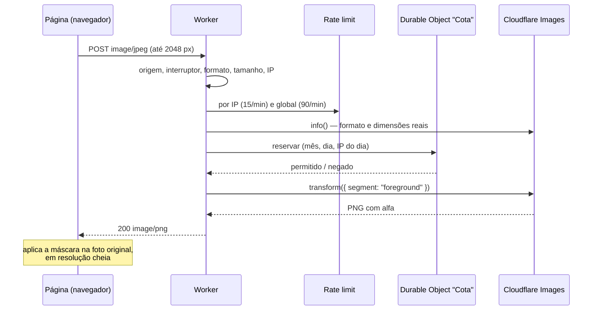

# Worker do removedor de fundo

Manual de operação do Worker da Cloudflare que faz o recorte principal do
[Removedor de fundo](https://www.geradoor.com/removedor-de-fundo).

Este documento responde a como o Worker funciona, o que ele aceita e devolve,
por que ele não gera cobrança, e o que fazer para publicar, mudar limites,
pausar ou investigar um problema. As decisões de produto e de qualidade da
feature inteira — página, pincel, pincel mágico, modo leve, escolha do modelo
— estão em [`docs/removedor-de-fundo.md`](../../docs/removedor-de-fundo.md).

- **Nome do Worker:** `geradoor-removedor-de-fundo`
- **Endereço:** `https://geradoor-removedor-de-fundo.mathuscardoso.workers.dev/`
- **Conta:** a conta pessoal da Cloudflare (subdomínio `mathuscardoso.workers.dev`)
- **Código:** `src/index.ts` (requisição) e `src/cota.ts` (contador)
- **Configuração:** `wrangler.jsonc`
- **Deploy:** `npm run deploy:removedor`, na raiz do projeto

---

## Sumário

1. [O que o Worker faz](#1-o-que-o-worker-faz)
2. [Contrato HTTP](#2-contrato-http)
3. [Travas de custo](#3-travas-de-custo)
4. [Configuração](#4-configuração)
5. [Operação do dia a dia](#5-operação-do-dia-a-dia)
6. [Diagnóstico de problemas](#6-diagnóstico-de-problemas)
7. [Privacidade](#7-privacidade)
8. [Testes](#8-testes)
9. [Decisões de implementação](#9-decisões-de-implementação)
10. [Pendências conhecidas](#10-pendências-conhecidas)

---

## 1. O que o Worker faz

Recebe uma imagem no corpo de um `POST`, passa pelo **Cloudflare Images** com
`segment: "foreground"` — que roda o modelo **BiRefNet** — e devolve um PNG
com o fundo transparente. Nada é gravado: a imagem entra, é processada e sai.

O Worker **não** entrega o arquivo final para a pessoa. Ele devolve a máscara
de uma cópia reduzida da foto, e o navegador aplica essa máscara na foto
original, em resolução cheia. Por isso os limites de tamanho daqui são
apertados e não afetam a qualidade do que a pessoa baixa.



Quem chama o Worker, na página, é `src/lib/useRemovedorDeFundo.ts`
(`enviarAoRemovedor`), em dois momentos:

1. **Recorte principal:** uma chamada por foto enviada.
2. **Pincel mágico:** uma chamada por pincelada, com um recorte da região em
   volta do traço (até 1024 px). Cada pincelada mágica conta na cota
   exatamente como uma foto.

---

## 2. Contrato HTTP

### Requisição

| Item | Valor |
|---|---|
| Método | `POST` (e `OPTIONS` para o preflight de CORS) |
| `Content-Type` | `image/jpeg`, `image/png` ou `image/webp` |
| Corpo | os bytes da imagem, sem multipart |
| Tamanho | até **8 MB** |
| Dimensões | lado maior até **4096 px** e área até **16 MP** |
| Origem | precisa estar em `ORIGENS_PERMITIDAS` |

A página sempre manda JPEG com qualidade 0,92 e lado maior de até 2048 px
(`LADO_MAXIMO_DE_ENVIO` em `src/lib/removedorDeFundo.ts`). Os tetos do Worker
têm folga sobre isso de propósito: se o limite da página mudar, uma versão
antiga dela em cache no navegador de alguém não quebra.

### Resposta de sucesso

`200`, `Content-Type: image/png`, com:

- `Access-Control-Allow-Origin` igual à origem que chamou (nunca `*`);
- `Cache-Control: no-store`;
- `X-Content-Type-Options: nosniff`;
- `Server-Timing: recorte;dur=<ms>`, o tempo gasto só no Images.

O PNG tem o tamanho da imagem enviada. A página usa apenas o canal alfa dele.

### Respostas de erro

Todo erro é JSON no formato `{ "motivo": "<motivo>" }`, com `no-store`. O
**motivo** é um identificador estável, e não uma frase: quem decide o texto
mostrado e se vale cair para o modo leve é a página
(`interpretarFalha`, em `src/lib/removedorDeFundo.ts`).

| Status | `motivo` | Quando acontece | O que a página faz |
|---|---|---|---|
| 403 | `origem` | origem ausente ou fora de `ORIGENS_PERMITIDAS` | modo leve, com aviso de "não respondeu"¹ |
| 405 | `metodo` | método diferente de `POST`/`OPTIONS` | não acontece pela página |
| 503 | `pausado` | `REMOVEDOR_ATIVO` diferente de `"true"` | modo leve, com aviso de "não respondeu" |
| 415 | `formato` | `Content-Type` fora de JPEG, PNG e WebP | mensagem: "Não foi possível ler essa imagem" |
| 413 | `tamanho` | mais de 8 MB, mais de 4096 px de lado ou mais de 16 MP | mensagem: "passou do tamanho que o removedor aceita" |
| 400 | `indisponivel` | a requisição chegou sem `CF-Connecting-IP` | modo leve, com aviso de "não respondeu" |
| 429 | `limite` | rajada: mais de 15/min do mesmo IP ou 90/min somando todos | mensagem: "Espere um minuto e tente de novo" |
| 400 | `imagem` | corpo vazio, ou o Images não reconhece o arquivo como imagem | mensagem: "Não foi possível ler essa imagem" |
| 429 | `limite-ip-dia` | o IP chegou ao limite do dia | modo leve, com aviso de que os recortes completos voltam amanhã |
| 503 | `cota-diaria` | o site inteiro chegou ao limite do dia | modo leve, com aviso de que volta amanhã |
| 503 | `cota` | o site chegou ao limite do mês, ou o Images respondeu 9422/9432 | modo leve, com aviso de limite do mês |
| 429 | `limite` | o próprio Images respondeu 429 | mensagem: "Espere um minuto e tente de novo" |
| 503 | `indisponivel` | contador fora do ar, Images com erro, resposta vazia | modo leve, com aviso de "não respondeu" |
| 500 | `indisponivel` | exceção não prevista | modo leve, com aviso de "não respondeu" |

¹ O navegador bloqueia por CORS a resposta de uma origem não permitida, então
a página nem chega a ler o motivo: para ela é uma falha de rede, e falha de
rede cai no modo leve. É o que acontece em **deploys de preview da Vercel**,
cujos endereços não estão na lista (ver [seção 10](#10-pendências-conhecidas)).

Respostas `429` e `503` levam `Retry-After` (60 s para rajada e contador, 30 s
para falha do Images, 3600 s para cota).

### Ordem das verificações

A ordem em `atender()` vai da verificação mais barata à mais cara, e é o que
garante que nada inválido gaste cota:

1. `OPTIONS` → responde o preflight (só para origem permitida).
2. Método precisa ser `POST`.
3. Origem precisa estar na lista.
4. **Interruptor manual** (`REMOVEDOR_ATIVO`). Responde antes de contar
   qualquer coisa.
5. `Content-Type` precisa ser JPEG, PNG ou WebP.
6. `Content-Length` declarado, se houver, não pode passar de 8 MB.
7. `CF-Connecting-IP` precisa existir.
8. **Rate limit** por IP e global, em paralelo.
9. Leitura do corpo com teto de 8 MB, abortando no primeiro byte a mais — sem
   confiar no `Content-Length`, que o cliente pode mentir.
10. `IMAGES.info()` confere o **formato real** e as dimensões.
11. **Reserva na cota** (Durable Object). Negou → erro; contador fora do ar →
    `indisponivel` (falha fechada).
12. `IMAGES.input().transform({ segment: "foreground" }).output({ format: "image/png" })`.
13. Se o Images disser que a cota do mês acabou, o contador é **esgotado**
    para o resto do mês.

---

## 3. Travas de custo

A regra do projeto é: **nada aqui pode gerar cobrança na conta da Cloudflare.**

### Por que não há cobrança

| Serviço | Limite gratuito | O que acontece ao passar |
|---|---|---|
| Cloudflare Images (plano Free) | 5.000 transformações únicas por mês | o Images responde erro **9422** e não cobra |
| Workers (plano Free) | 100.000 requisições por dia | as requisições falham; não há cobrança por uso |
| Durable Objects com SQLite (plano Free) | cota diária do plano Free | as chamadas falham, e o Worker fecha a porta (ver abaixo) |
| Rate Limiting binding | incluído no Workers | — |

> **Atenção:** essa garantia vale enquanto a conta estiver nos planos
> **Free** do Workers e do Images. Se um dia a conta assinar o Workers Paid ou
> o Images Paid, os limites passam a ser cobrados por uso em vez de
> bloqueados, e as travas abaixo viram a única proteção. Revise os valores
> antes de mudar de plano.

Mesmo com a garantia do plano Free, o Worker para **antes** do limite da
Cloudflare. Motivos:

- A documentação da Cloudflare não diz exatamente como a remoção de fundo é
  contada. O contador assume o pior caso: **cada chamada vale uma
  transformação**, mesmo que a Cloudflare conte a mesma imagem repetida uma
  vez só.
- Parar antes mantém o comportamento sob controle do código (motivo `cota`,
  modo leve com aviso claro), em vez de depender da resposta de erro de um
  serviço externo.

### As camadas, da mais barata à mais cara

| # | Trava | Valor atual | Onde |
|---|---|---|---|
| 1 | Interruptor manual | `REMOVEDOR_ATIVO = "true"` | `wrangler.jsonc` → `vars` |
| 2 | Origem permitida (CORS) | domínios do Geradoor e localhost | `wrangler.jsonc` → `vars` |
| 3 | Formato e tamanho declarados | JPEG/PNG/WebP, 8 MB | `src/index.ts` |
| 4 | Rajada por IP | 15 por 60 s | `wrangler.jsonc` → `ratelimits` |
| 5 | Rajada global | 90 por 60 s | `wrangler.jsonc` → `ratelimits` |
| 6 | Formato e dimensões reais | 4096 px de lado, 16 MP | `src/index.ts` |
| 7 | Limite por IP por dia | **150** (temporário; o planejado é 40) | `wrangler.jsonc` → `LIMITE_POR_IP_DIA` |
| 8 | Limite global por dia | 300 | `wrangler.jsonc` → `LIMITE_DIARIO` |
| 9 | Limite global por mês | 4.800 | `wrangler.jsonc` → `LIMITE_MENSAL` |
| 10 | Teto absoluto mensal | **4.900**, ignora configuração acima disso | `src/cota.ts` → `TETO_ABSOLUTO_MENSAL` |
| 11 | Falha fechada | contador fora do ar → Images não é chamado | `src/index.ts` → `consultarCota` |
| 12 | Sincronização com a Cloudflare | erro 9422/9432 → contador do mês vai ao limite | `src/cota.ts` → `esgotar` |

Observações sobre cada trava:

- **CORS não é segurança contra script.** Qualquer programa fora do navegador
  ignora CORS e chama o Worker direto. Quem protege contra isso são as travas
  4 a 12. CORS só impede outros sites de usarem o Worker a partir do navegador
  dos visitantes deles.
- **Rate limiting é aproximado.** O contador do binding é mantido por
  data center da Cloudflare, não globalmente, e só aceita janelas de 10 ou
  60 s. Ele serve para cortar rajadas baratas antes que elas cheguem ao
  contador. O limite rígido é o do Durable Object.
- **O IP vem de `CF-Connecting-IP`**, que a Cloudflare preenche no edge. Nunca
  de `X-Forwarded-For`, que qualquer cliente escreve: bastaria trocar o header
  para zerar o próprio limite. Sem `CF-Connecting-IP`, a requisição é recusada
  em vez de cair num balde compartilhado.
- **A reserva vem depois da validação.** Arquivo inválido não gasta recorte de
  ninguém.
- **A reserva não é devolvida se o Images falhar.** Contar a mais é o erro
  seguro. Na prática, um Images instável consome cota sem entregar recorte; é
  uma escolha consciente.
- **Negativa não consome.** Quem foi negado e tenta de novo não soma no
  contador.
- **O diário existe para proteger o mês.** Com 300 por dia, um único dia de
  abuso não leva mais que ~6% do mês.
- **Valores inválidos nunca viram "sem limite".** Variável ausente, vazia, não
  numérica, zero ou negativa cai no padrão de `LIMITES_PADRAO` (mensal 4.500,
  diário 200, por IP 25). O mensal é sempre limitado a 4.900.

### O contador (`src/cota.ts`)

Um único Durable Object, endereçado por `idFromName("global")`, com uma tabela
SQLite:

```sql
CREATE TABLE uso (chave TEXT PRIMARY KEY, total INTEGER NOT NULL)
```

| Chave | Exemplo | Conta |
|---|---|---|
| `mes:AAAA-MM` | `mes:2026-09` | recortes do mês |
| `dia:AAAA-MM-DD` | `dia:2026-09-15` | recortes do dia, somando todos |
| `ip:AAAA-MM-DD:<hash>` | `ip:2026-09-15:3fa1…` | recortes de um IP no dia |

- **Por que Durable Object, e não KV:** o KV é eventualmente consistente. Duas
  requisições simultâneas no último recorte do mês passariam as duas. No
  Durable Object, as leituras e escritas SQL são síncronas dentro da
  requisição, sem `await` entre ler e somar, então a reserva é atômica.
- **Por que SQLite:** é o único backend de Durable Object disponível no plano
  Free.
- **Períodos em UTC**, o mesmo fuso em que a Cloudflare reinicia as cotas. No
  horário de Brasília (UTC−3), **o dia vira às 21h** e o mês vira às 21h do
  último dia do mês.
- **Limpeza:** na primeira reserva de cada dia, as linhas de IP e de dia
  anteriores são apagadas. As de mês ficam (doze por ano).
- **Operações:** `reservar` (confere e soma nas três chaves) e `esgotar` (leva
  o mês ao limite configurado, sem nunca diminuir o total).

---

## 4. Configuração

Tudo fica em `wrangler.jsonc`. Não há segredos: nenhum valor deste Worker é
sensível, e por isso não há `wrangler secret`.

### Bindings

| Binding | Tipo | Para quê |
|---|---|---|
| `IMAGES` | Cloudflare Images | `info()` e o recorte com `segment: "foreground"` |
| `LIMITE_POR_IP` | Rate Limiting (namespace `4201`) | 15 requisições por 60 s por IP |
| `LIMITE_GLOBAL` | Rate Limiting (namespace `4202`) | 90 requisições por 60 s somando todos |
| `COTA` | Durable Object, classe `Cota` | contador de mês, dia e IP |

A migração `v1` (`new_sqlite_classes: ["Cota"]`) cria a classe. **Nunca apague
nem renomeie essa migração**: o Wrangler recusaria o deploy, e mexer nela para
forçar pode apagar o contador — e com ele o controle do mês corrente.

### Variáveis

| Variável | Valor atual | Efeito |
|---|---|---|
| `REMOVEDOR_ATIVO` | `"true"` | Qualquer outro valor, ou a variável ausente, desliga o recorte (`pausado`). |
| `LIMITE_MENSAL` | `"4800"` | Recortes por mês, somando todos. Nunca passa de 4.900. |
| `LIMITE_DIARIO` | `"300"` | Recortes por dia, somando todos. |
| `LIMITE_POR_IP_DIA` | `"150"` | Recortes por IP por dia. **Temporário**: voltar para `"40"`. |
| `ORIGENS_PERMITIDAS` | `https://www.geradoor.com,https://geradoor.com,http://localhost:3000,http://localhost:3001,http://localhost:3100` | Origens que recebem CORS. Separadas por vírgula, comparadas por igualdade exata. |

### Outras opções

- `compatibility_date: "2026-09-01"`
- `workers_dev: true` — publica no subdomínio `workers.dev`, que é o endereço
  usado pela página.
- `preview_urls: false` — sem URLs de preview por versão do Worker.
- `observability.enabled: true` — logs de invocação no painel da Cloudflare.

### Do lado da página

| Onde | O quê |
|---|---|
| `NEXT_PUBLIC_REMOVEDOR_URL` (opcional) | Aponta a página para outro deploy do Worker. Sem ela, vale o endereço fixo em `src/lib/removedorDeFundo.ts`. Não é segredo. Por ser `NEXT_PUBLIC_`, entra no bundle no **build**: mudar exige novo deploy da Vercel. |
| `LADO_MAXIMO_DE_ENVIO` | 2048 px, o lado maior da cópia enviada no recorte principal. |
| `TEMPO_LIMITE_MS` | 30 s de espera antes de desistir e cair no modo leve. |

---

## 5. Operação do dia a dia

Todos os comandos rodam na **raiz do projeto**. O Wrangler é fixado na versão
`4.131.2` via `npx`, então não precisa estar instalado.

### Primeiro acesso numa máquina nova

```bash
npx --yes wrangler@4.131.2 login     # abre o navegador para autorizar a conta
npx --yes wrangler@4.131.2 whoami    # confere que é a conta certa
```

### Publicar

```bash
npm run deploy:removedor
```

Publica o Worker com a configuração de `wrangler.jsonc`. Leva poucos segundos
e não depende do deploy da Vercel: **mudanças no Worker não sobem com o push
na `main`**. Mudanças na página sobem com o push; mudanças no Worker precisam
deste comando.

Antes de publicar, rode os testes do Worker (ver [seção 8](#8-testes)).

### Conferir que está no ar

```bash
# Preflight de uma origem permitida: deve responder 204
curl -s -o /dev/null -w "%{http_code}\n" -X OPTIONS \
  -H "Origin: https://www.geradoor.com" \
  -H "Access-Control-Request-Method: POST" \
  https://geradoor-removedor-de-fundo.mathuscardoso.workers.dev/

# GET: deve responder 405 com {"motivo":"metodo"}
curl -s -w " %{http_code}\n" https://geradoor-removedor-de-fundo.mathuscardoso.workers.dev/
```

Nenhum dos dois consome cota. Um teste de recorte de verdade (`POST` com uma
imagem) consome um recorte do mês, do dia e do seu IP.

### Mudar um limite

1. Edite a variável em `wrangler.jsonc` (e o comentário ao lado, se o motivo
   mudar).
2. `npm run deploy:removedor`.
3. Faça commit da mudança, para o repositório refletir o que está no ar.

O novo valor vale na próxima requisição. Os contadores não são zerados:
baixar o limite abaixo do uso atual bloqueia na hora; subir libera na hora.

**Pendência atual:** `LIMITE_POR_IP_DIA` está em `150`, liberado para testes.
Deve voltar para `40`.

### Pausar em emergência

Sinal de abuso, conta com uso estranho, qualquer dúvida sobre custo:

1. Em `wrangler.jsonc`, troque `"REMOVEDOR_ATIVO": "true"` por `"false"`.
2. `npm run deploy:removedor`.

A partir daí o Worker responde `503 pausado` sem contar nada e sem chamar o
Images. **A página continua funcionando**: todo recorte cai no modo leve, no
aparelho da pessoa, com aviso. O pincel mágico passa a aplicar o pincel comum,
também com aviso.

Para uma pausa ainda mais rápida, sem mexer no repositório, dá para editar a
variável no painel da Cloudflare (Workers & Pages → `geradoor-removedor-de-fundo`
→ Settings → Variables). O próximo `npm run deploy:removedor` sobrescreve
o valor do painel com o do arquivo, então replique a mudança no
`wrangler.jsonc`.

Para religar, volte o valor para `"true"` e publique.

### Ver logs em tempo real

```bash
npx --yes wrangler@4.131.2 tail geradoor-removedor-de-fundo
```

O Worker só escreve no console em falhas: `[removedor-de-fundo] cota` (o
contador não respondeu) e `[removedor-de-fundo]` (exceção não prevista).
Recusas esperadas — limite, formato, origem — não geram log além da própria
invocação.

O histórico fica em Workers & Pages → `geradoor-removedor-de-fundo` →
Observability, no painel da Cloudflare.

### Ver o uso

- **Uso do Images no mês:** painel da Cloudflare → Images → visão geral de
  uso / transformações. É o número que a Cloudflare usa para o limite de 5.000.
- **Contador interno:** não há endpoint que exponha os totais do Durable
  Object, de propósito — seria mais uma superfície pública. Para uma
  estimativa, conte as invocações com status 200 em Observability. O contador
  interno sempre fica **igual ou acima** do número da Cloudflare, porque conta
  toda reserva, inclusive as que falharam no Images; então, se o painel do
  Images mostra folga, o contador está no máximo um pouco adiante dele.

### Zerar um contador

Não há comando para isso, e é intencional: zerar o contador do mês é a forma
mais fácil de perder o controle de custo. Se for mesmo necessário — por
exemplo, testes que consumiram o limite do seu IP —, a saída segura é subir o
limite temporariamente (como foi feito com o `LIMITE_POR_IP_DIA`) e depois
voltar. O contador por IP também zera sozinho na virada do dia (21h de
Brasília).

### Liberar uma nova origem

Domínio novo, ou um ambiente de preview que precise do recorte completo:

1. Acrescente a origem exata (esquema, domínio e porta, sem barra no fim) a
   `ORIGENS_PERMITIDAS`.
2. `npm run deploy:removedor`.

Não use curinga: a comparação é por igualdade, e isso é o que impede
`https://geradoor.com.golpe.com` de passar.

---

## 6. Diagnóstico de problemas

| Sintoma | Causa provável | O que fazer |
|---|---|---|
| Todo recorte sai no modo leve com "O removedor completo não respondeu" | Worker pausado, fora do ar, origem não permitida ou contador com erro | `curl` da seção 5; conferir `REMOVEDOR_ATIVO`; `wrangler tail` procurando `[removedor-de-fundo] cota` |
| Só no preview da Vercel sai no modo leve | Origem do preview não está em `ORIGENS_PERMITIDAS` | Esperado. Liberar a origem se precisar testar o recorte completo |
| "Você já usou todos os recortes completos de hoje" | IP chegou a `LIMITE_POR_IP_DIA` | Esperar a virada do dia (21h de Brasília) ou subir o limite temporariamente |
| "O removedor completo atingiu o limite de hoje" | Site chegou a `LIMITE_DIARIO` | Conferir se é uso legítimo ou abuso; ajustar ou pausar |
| "O removedor completo atingiu o limite do mês" | `LIMITE_MENSAL` ou erro 9422 do Images | Não subir acima de 4.900. Espera a virada do mês |
| "Muitas imagens em sequência" | Rajada por IP (15/min) ou global (90/min), ou 429 do Images | Esperado em uso intenso. Se for frequente com uso legítimo, revisar os valores de `ratelimits` |
| Preflight responde 403 | Origem fora da lista, ou diferente por um detalhe (`www`, porta, `http`) | Conferir a origem exata que o navegador manda |
| Deploy falha falando de migração | Migração `v1` alterada ou removida | Restaurar a migração original; nunca editar migração já publicada |
| Deploy publica numa conta errada | Wrangler logado em outra conta | `wrangler whoami`; `wrangler logout` e `login` na conta pessoal |
| `wrangler` com versão estranha na saída | Algum wrapper de shell interceptando | Usar sempre `npx --yes wrangler@4.131.2` |

---

## 7. Privacidade

- **A imagem não é gravada.** Ela é lida para a memória, passada ao Images e
  descartada ao fim da requisição. O Worker não usa R2, KV nem cache para ela,
  e responde com `Cache-Control: no-store`.
- **O IP não é gravado.** O contador guarda `SHA-256(dia + ":" + IP)`,
  truncado em 24 caracteres hexadecimais. Como o dia entra no hash, o mesmo IP
  gera um identificador diferente a cada dia, e os de dias anteriores são
  apagados na primeira requisição do dia seguinte.
- **A página manda sem cookie e sem referer** (`credentials: "omit"`,
  `referrerPolicy: "no-referrer"`).
- **Observabilidade:** com `observability.enabled`, a Cloudflare guarda logs
  de invocação (metadados da requisição e o que o Worker escreve no console)
  pelo prazo de retenção da conta. O Worker nunca escreve a imagem nem o IP no
  console.

Isso é o que sustenta os textos da página: "A imagem é processada na hora e
descartada. Não salvamos nenhuma cópia."

---

## 8. Testes

```bash
npx vitest run workers                      # só o Worker
npm test                                    # suíte inteira do projeto
```

O `vitest.config.ts` da raiz inclui `workers/**/*.test.ts`.

| Arquivo | O que garante |
|---|---|
| `src/cota.test.ts` | Leitura dos limites (padrão para valor inválido, teto absoluto), ordem das negativas, períodos em UTC, hash do IP que muda por dia, e o Durable Object de verdade sobre SQLite: limite por IP sem afetar outro IP, negativa que não consome, virada de dia com limpeza, limite mensal atravessando dias e IPs, `esgotar` que nunca diminui. |
| `src/index.test.ts` | O fluxo de `atender()` com bindings falsos: CORS exato e sem curinga, preflight, recusa de origem antes de gastar limite, método, formato declarado e real, `Content-Length` declarado e mentido, IP do edge e não de header, dimensões, tradução do 9422/9432 para `cota` com `esgotar`, interruptor (inclusive ausente = desligado), rajada global, **falha fechada** do contador, imagem inválida que não consome, reserva com hash e não com IP. |

O contador é testado sobre o `node:sqlite` real (Node 22.5+), e não sobre um
mock, porque o que se quer garantir é justamente o SQL. `src/node-sqlite.d.ts`
tipa o mínimo usado do módulo.

---

## 9. Decisões de implementação

- **Tipos à mão em vez de `@cloudflare/workers-types`.** O projeto compila com
  a lib DOM, e os tipos do Workers não convivem com ela no mesmo programa.
  `index.ts` e `cota.ts` descrevem só o pedaço dos bindings que usam, e o
  `tsc` da raiz continua cobrindo o Worker sem configuração extra.
- **Durable Object com a API `fetch`.** O Worker conversa com o contador por
  `POST https://cota/` com JSON (`{ operacao: "reservar" | "esgotar", … }`).
  Os limites vão no pedido, para que o objeto não dependa de variáveis de
  ambiente próprias.
- **Motivos em vez de mensagens.** O Worker não sabe o texto que a pessoa vai
  ler, nem se a página tem modo leve. Ele diz o que aconteceu; a página decide.
- **PNG na saída.** É o formato que o Images devolve com alfa sem perda. A
  página só lê o alfa, então o custo de banda do RGB junto é aceito em troca
  de não depender de formato de máscara específico.
- **Sem autenticação.** A ferramenta é pública e sem cadastro. As travas de
  custo tornam o abuso inofensivo para a conta: o pior caso é o recorte
  completo acabar mais cedo no mês e o site cair no modo leve.

---

## 10. Pendências conhecidas

- **`LIMITE_POR_IP_DIA` em 150**, liberado para testes. Voltar para `40` e
  publicar.
- **Previews da Vercel caem no modo leve**, porque as origens de preview mudam
  a cada deploy e não estão em `ORIGENS_PERMITIDAS`. Para testar o recorte
  completo num preview, libere a origem daquele preview temporariamente.
- **Sem painel de uso próprio.** O uso é visto no painel da Cloudflare. Um
  endpoint de leitura dos contadores exigiria autenticação e foi deixado de
  fora.
- **Variante do BiRefNet não é configurável.** O Cloudflare Images não expõe
  qual variante ou resolução do modelo roda. Trocar de modelo significa trocar
  de serviço (ver `docs/removedor-de-fundo.md`, seção de escolha do modelo).
